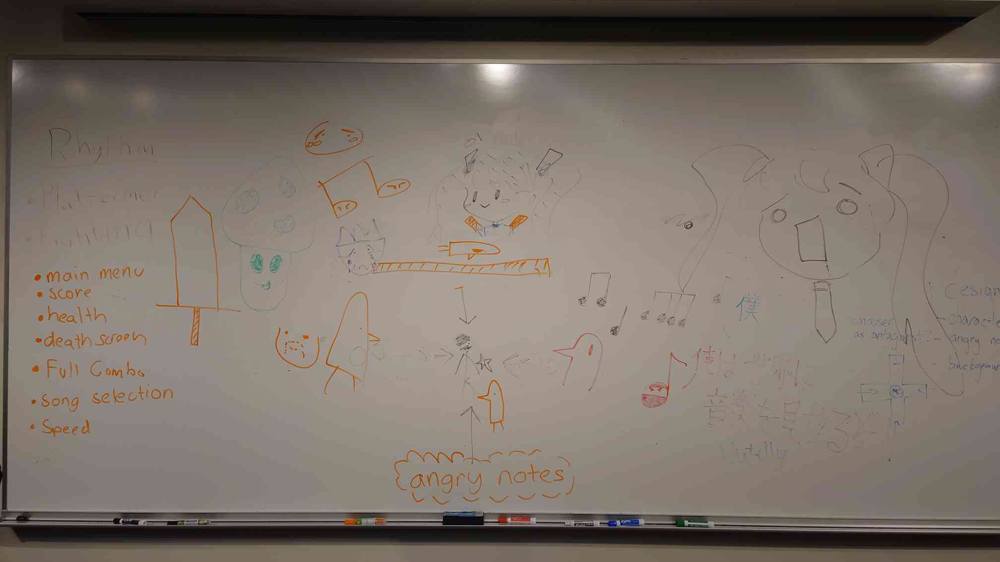

- [Home](./index.md)
- [Guide](./guide.md)
- [Gallery](./gallery.md)
- ### [Credits](./credits.md)

---

## Credits

**Melancholia** was created through the collaborative efforts of the Game Design Club at the University of San Francisco. We’re proud to recognize the contributions of every team member involved in bringing this project together.

<figure style="text-align: center; margin-bottom: 40px;">
  
  <figcaption>Brainstorming session on the whiteboard</figcaption>
</figure>

---

### Programming & Game Design
- Andrew D.

### Visual Art & UI Design
- Jake P.
- Dorian G.
- Lauren Y.
- Lillian L.

---

### Audio & Music Resources

We used the following resources for sound effects and music:

- [Zapsplat](https://www.zapsplat.com/)
- [MuseScore](https://musescore.org/en)

---

### License

All game code and visual assets are © 2025 Game Design Club, University of San Francisco.
These assets are licensed **for personal and educational use only**.
Commercial use or redistribution requires explicit permission from the copyright holders.