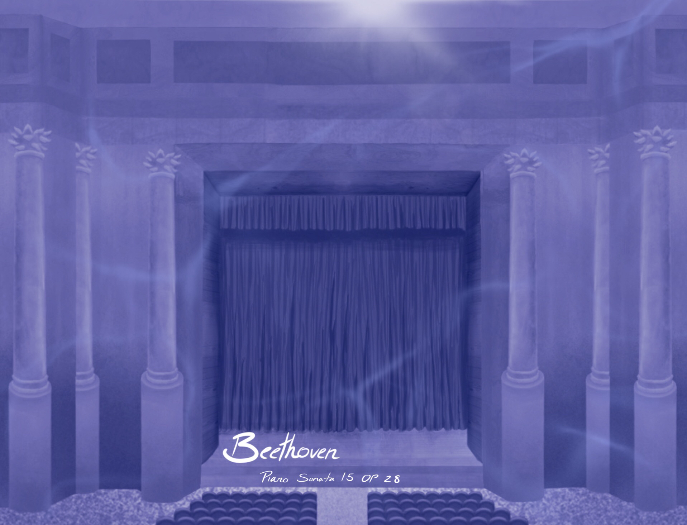
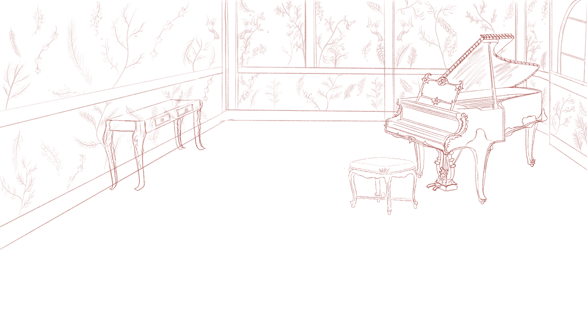
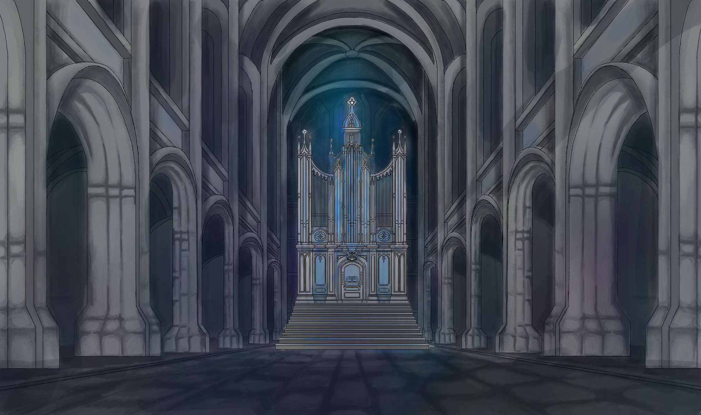
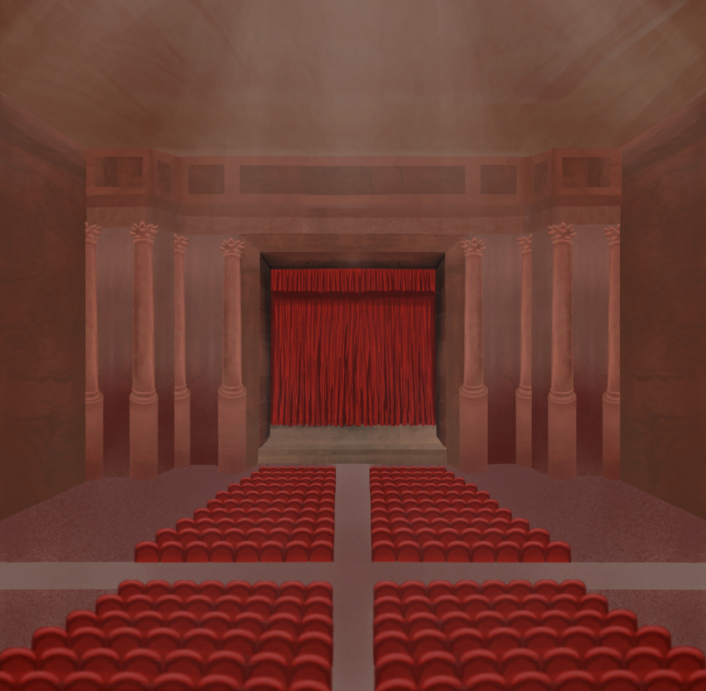
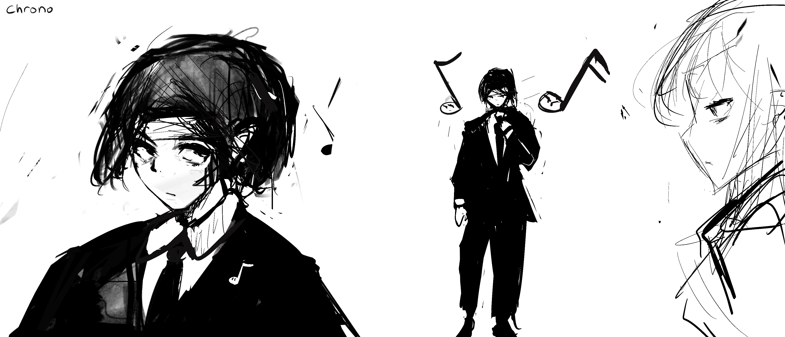
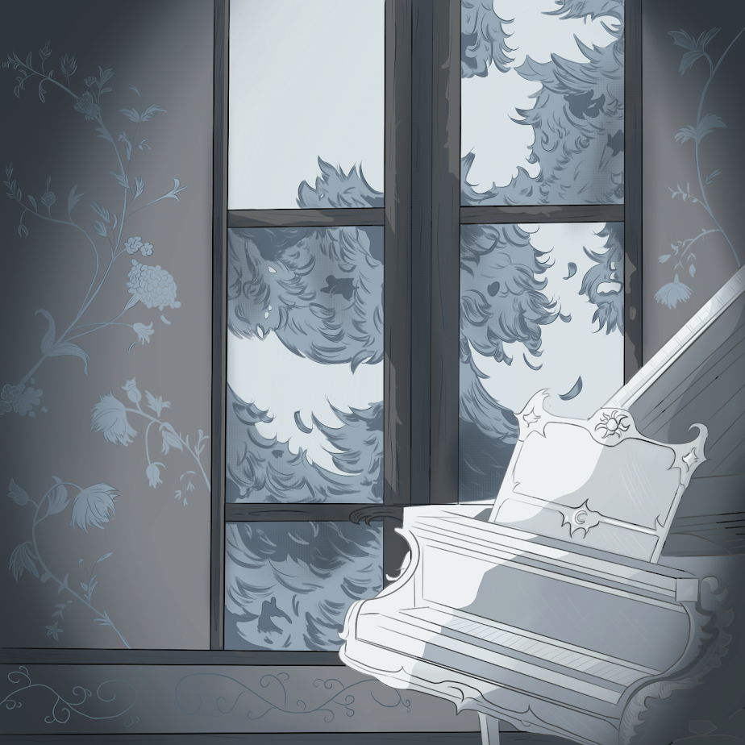
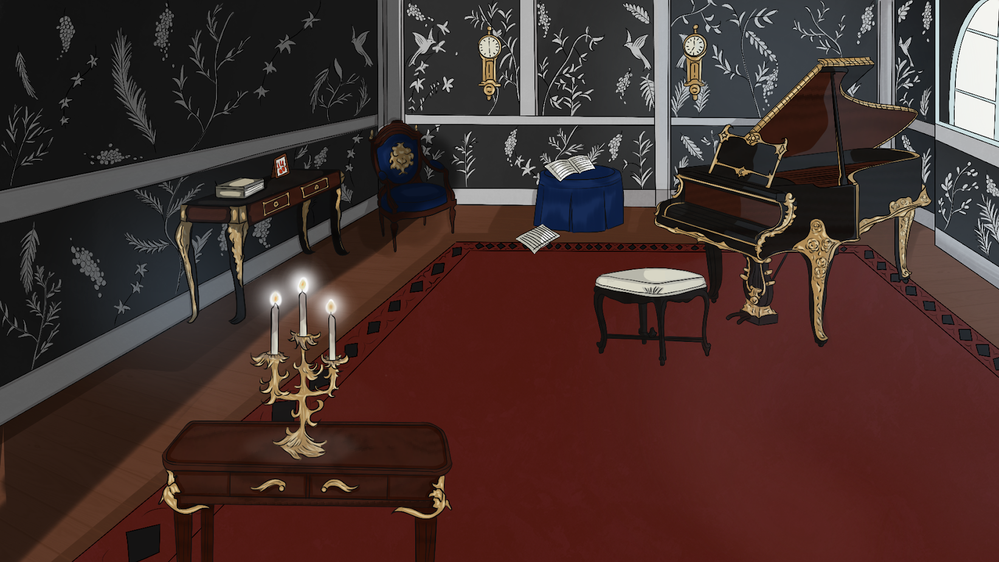
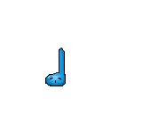
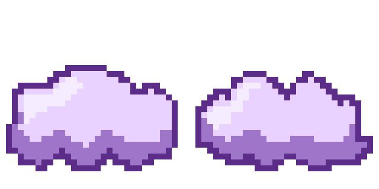

- [Home](./index.md)
- [Guide](./guide.md)
- [Story](./story.md)
- ### [Gallery](./gallery.md)
- [Credits](./credits.md)

---

## Welcome to Melancholia Art Gallery

### Backgrounds

<figure style="text-align: center;">
  
  <figcaption>Album Cover</figcaption>
</figure>

<figure style="text-align: center;">
  
  <figcaption>Level 1: Draft</figcaption>
</figure>

<figure style="text-align: center;">
  
  <figcaption>Level 2: Sapphire</figcaption>
</figure>

<figure style="text-align: center;">
  
  <figcaption>Level 3: Halloween</figcaption>
</figure>

<figure style="text-align: center;">
  
  <figcaption>Level 4: Clouds</figcaption>
</figure>

<figure style="text-align: center;">
  
  <figcaption>Level 5: Christmas</figcaption>
</figure>

<figure style="text-align: center;">
  
  <figcaption>Level 6: Ruby</figcaption>
</figure>

<figure style="text-align: center;">
  
  <figcaption>Level 7: Chrono</figcaption>
</figure>

<figure style="text-align: center;">
  
  <figcaption>Level 8: Frosty</figcaption>
</figure>

<figure style="text-align: center;">
  
  <figcaption>Level 9: Merry</figcaption>
</figure>

<figure style="text-align: center;">
  
  <figcaption>Level 10: Amethyst</figcaption>
</figure>

---

### Sprites

<figure style="text-align: center;">
  
  <figcaption>Chrono (Idle)</figcaption>
</figure>

<figure style="text-align: center;">
  
  <figcaption>Chrono (Walk Animation)</figcaption>
</figure>

<figure style="text-align: center;">
  
  <figcaption>Chrono (Side View)</figcaption>
</figure>

<figure style="text-align: center;">
  
  <figcaption>Chrono (Back View)</figcaption>
</figure>

<figure style="text-align: center;">
  
  <figcaption>Blue Note</figcaption>
</figure>

<figure style="text-align: center;">
  
  <figcaption>Green Note</figcaption>
</figure>

<figure style="text-align: center;">
  
  <figcaption>Red Note</figcaption>
</figure>

<figure style="text-align: center;">
  
  <figcaption>Yellow Note</figcaption>
</figure>

<figure style="text-align: center;">
  
  <figcaption>Cloud Platform</figcaption>
</figure>
