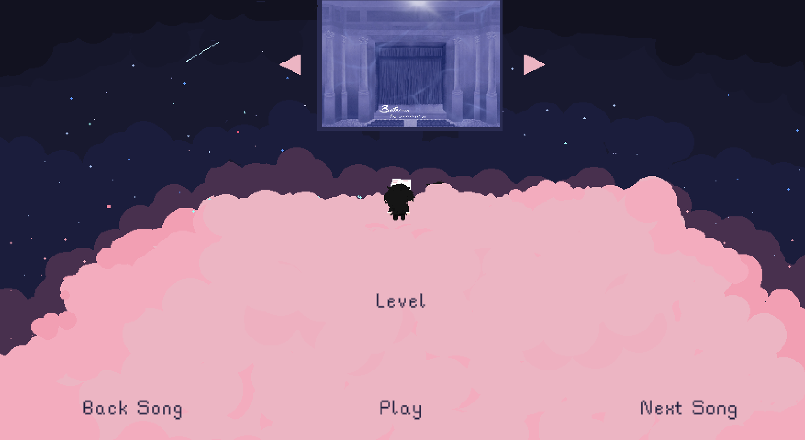
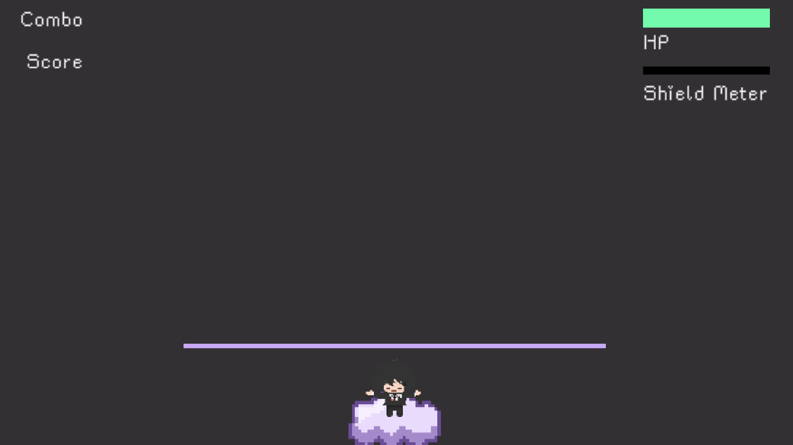
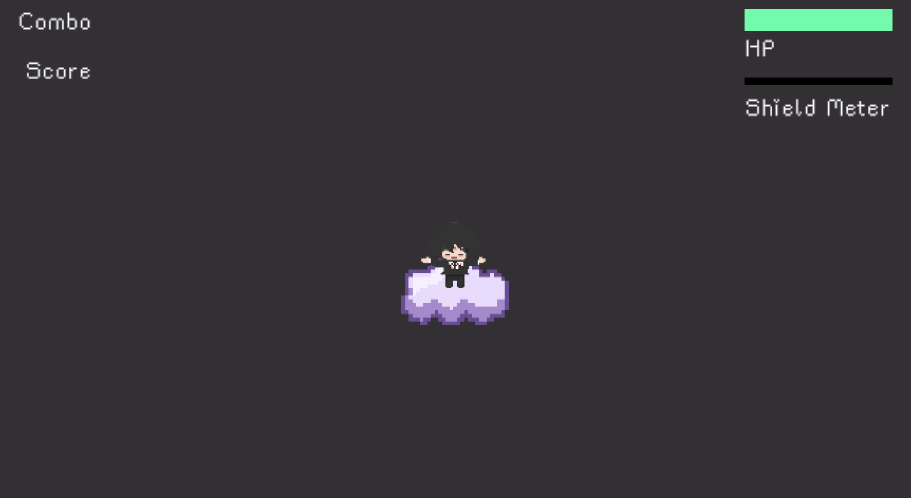

- [Home](./index.md)
- ### [Guide](./guide.md)
- [Gallery](./gallery.md)
- [Credits](./credits.md)

---

## Navigation

When you hit **Start**, you’ll be taken to the **Song Select** screen. Use the **Next** and **Previous** buttons to browse through the available levels. There are **10 levels**, each featuring a unique piece of classical music. The first level is designed to get yourself familar with the game, and therefore the easiest. The remaining levels vary in difficulty.

You can also use keyboard shortcuts:
- **Z** → Previous song
- **X** → Next song
- **Spacebar** → Play the selected level
- **Esc** → Return to the home screen

---

Once you're in a level, you can pause at any time by pressing the **Spacebar**. Use this to:
- Restart the level
- Return to the main menu
- Take a break
- Or just admire the background art

Raw versions of the background images are available in the [Gallery](./gallery.md).

---

## Stances

When a level starts, you'll see notes moving in specific directions. The movement depends on your **stance**.

### Conductor Stance

In this stance, **Chrono** (the protagonist) acts as a conductor. Notes fall from the top in four vertical columns.

To play:
- **Z** → Leftmost column
- **X** → Second column
- **N** → Third column
- **M** → Rightmost column

Your goal is to hit the notes **just before** they reach the magenta line.

---

### Performer Stance

Here, Chrono stands at the center of the stage. Notes fly toward him from four directions: up, down, left, right.

To play:
- **W** → Notes from the top
- **S** → Notes from the bottom
- **A** → Notes from the left
- **D** → Notes from the right

Your goal is to hit the notes **just before they reach Chrono**.

---

## Hits

There are three types of note hits:

- **Accurate Hit**: Perfect timing. Heals a small amount of HP.
- **Inaccurate Hit**: Slightly too early. Small HP loss.
- **Miss**: Too early or too late. Significant HP loss.

---

## Combo & Score

- **Combo** increases with each **accurate hit** in a row.
  - Inaccurate hits do **not** break your combo but don’t continue it either.
  - Misses **reset** your combo.

- **Score** is based solely on the number of accurate hits.
  - Inaccurate hits and misses do **not** affect your score.

At the end of each game, your **max combo** and **score** will be displayed.

---

## Chaining Effect

When you hit a note, you don’t just destroy a single note. You destroy a **small area of notes** that are close together in time. This creates a **chaining effect**, wiping out clusters of nearby notes in one go.

---

## Shield Ability

As you land **accurate hits**, your **Shield Meter** will charge.

- When full, press **P** to activate the shield.
- The shield lasts a few seconds and makes you **invulnerable**:
  - Notes won’t damage you
  - Misses won’t register

The shield will come in handy as a **last resort**.
