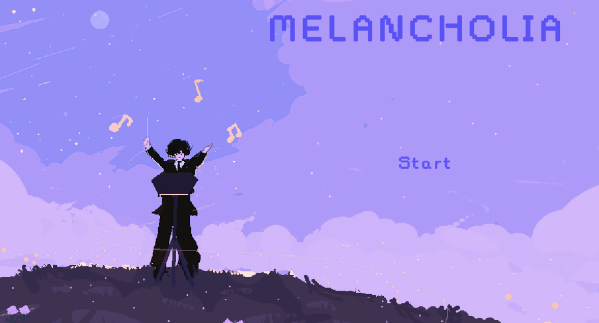

- ### [Home](./index.md)
- [How to Play](./guide.md)
- [Story](./story.md)
- [Art Gallery](./gallery.md)
- [Credits](./credits.md)

---

## Overview

**Melancholia** is a rhythm game developed by the Game Design Club at the University of San Francisco. Built in **Unity** using **C#**, the game challenges players to synchronize button presses with classical piano tracks.

---

## Project Vision

We believe music is one of the most defining elements of a game—it can elevate or undermine the entire experience. With *Melancholia*, our goal was to create a rhythm game where the music isn’t just background—it's the core.

Melancholia is loosely inspired by games like Dance Dance Revolution, osu!, and Friday Night Funkin'. The gameplay is designed to be simple and intuitive, requiring minimal thinking so players can focus on the music and visuals. We want the experience to be calm, meditative, and emotionally resonant—something that can be enjoyed without pressure.

---

## Events & Playtesting

Melancholia was showcased at the **2024 Anime Culture & Video Games Club (ACV) Halloween Scavenger Hunt** at the University of San Francisco. Over 30 participants played the game, where players must beat a level to earn a scavenger hunt clue.

This event also served as a valuable playtest. One major piece of feedback we received was to fine-tune the timing window for hitting notes—something we’ve since started improving to enhance responsiveness and flow.